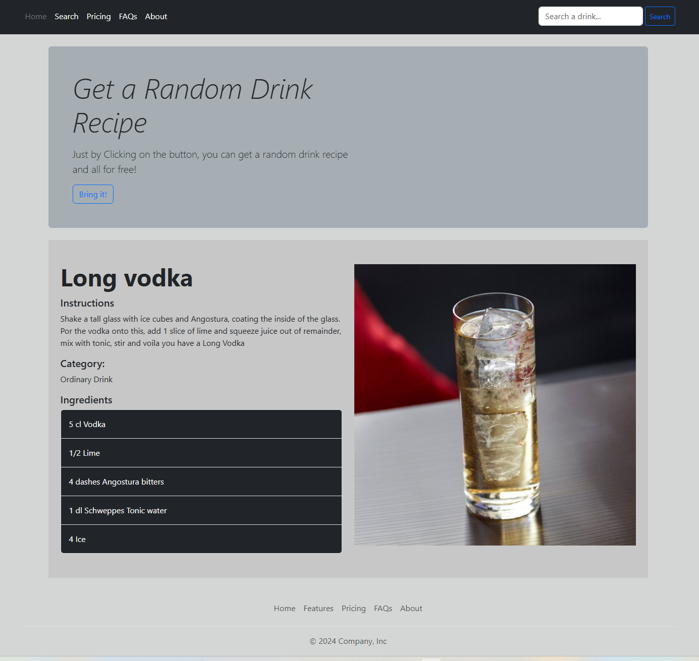

<p align="center">

</p>

# 🍸 Drink Recipe Finder & Social Platform

[](https://github.com/AsHkAn-Django/Drink-Recipe-Finder-with-Favorites-Reviews/actions/workflows/deploy.yml)


A production-grade, containerized web application that bridges external API data with local user persistence. This project demonstrates a **Hybrid Data Architecture**, merging real-time data fetching from **TheCocktailDB** with a local PostgreSQL database for social features like favorites and reviews.

It is built with **DevOps best practices**, featuring a fully automated CI/CD pipeline, strict linting, and a robust testing suite that mocks external dependencies.

## Key Engineering Features

### DevOps & Architecture
* **Automated CI/CD Pipeline:** Built with **GitHub Actions**. Every push to `main` triggers:
    1.  **Linting:** Flake8 & Black for code quality.
    2.  **Testing:** Runs the full Pytest suite (Models, Views, API Integration).
    3.  **Deployment:** If tests pass, it automatically SSHs into the VPS, pulls code, rebuilds Docker containers, and runs migrations with zero downtime.
[](https://github.com/AsHkAn-Django/Drink-Recipe-Finder-with-Favorites-Reviews/actions/workflows/deploy.yml)

* **Containerized Environment:** Fully Dockerized services (Web, Postgres) orchestrated via `docker-compose`.
* **Production Serving:** Configured with **Gunicorn** behind an **Nginx** reverse proxy for security, static file handling, and load balancing.

### Backend Logic
* **Hybrid Data Model:**
    * **Search:** Fetches live data from TheCocktailDB API.
    * **Persistence:** "Lazy-saving" mechanism. When a user favorites a drink, the external data is captured and saved to the local Postgres DB to reduce future API calls and enable relational features.
* **Social Engine:** Full review system allowing users to rate (1-5 stars) and comment on drinks.
* **Smart Aggregation:** Dynamic calculation of average ratings and review counts using Django Aggregates.

### Frontend
* **Responsive UI:** Built with **Bootstrap 5** and Django Templates, ensuring a seamless experience across mobile and desktop devices.

---

## System Architecture

| Component | Technology | Role |
| :--- | :--- | :--- |
| **App Server** | Django + Gunicorn | Core Application Logic |
| **Web Server** | Nginx | Reverse Proxy & Static Files |
| **Database** | PostgreSQL 15 | Persistent Data (Users, Favorites, Reviews) |
| **External API** | TheCocktailDB | Recipe Data Source |
| **Testing** | Pytest + Mock | Automated Testing Suite |

---

## Testing Strategy

Quality is a priority. The codebase is covered by **Automated Tests** using `pytest`.

* **Unit Tests:** Verifies Data Models (Recipe, Review) and custom methods.
* **Integration Tests:** Checks View logic, permissions, and redirects.
* **API Mocking:** We use `unittest.mock` to simulate TheCocktailDB responses. This ensures tests are:
    * **Fast:** No real network requests.
    * **Reliable:** Tests pass even if the external API goes down.
    * **Deterministic:** We control the data returned (e.g., simulating missing ingredients).

**Run the tests locally:**
```bash
docker compose exec web pytest
```

## Quick Start (Docker)
The easiest way to run this project is using Docker. This ensures the environment matches production exactly.

1. Clone the repository
```Bash
git clone [https://github.com/AsHkAn-Django/drink-recipe-finder.git](https://github.com/AsHkAn-Django/drink-recipe-finder.git)
cd drink-recipe-finder
```

2. Configure Environment Create a .env file in the root directory:
```Bash
SECRET_KEY=your_secret_key_here
DEBUG=True
ALLOWED_HOSTS=localhost,127.0.0.1

# Database Settings
DB_NAME=cocktail_db
DB_USER=recipe_user
DB_PASSWORD=MySimplePass123
DB_HOST=db
```

3. Launch the Stack
```Bash
docker compose up -d --build
```

4. Run Migrations
```Bash
docker compose exec web python manage.py migrate
docker compose exec web python manage.py collectstatic --noinput
```

The app will be available at http://localhost:8003.
## Manual Installation (Localhost)
If you prefer running without Docker:
1. Setup Virtual Environment
```Bash
python -m venv .venv
source .venv/bin/activate  # Windows: .venv\Scripts\activate
```

2. Install Dependencies
```Bash
pip install -r requirements.txt
```

3. Run Migrations & Server
```Bash
python manage.py migrate
python manage.py runserver
```

## 📚 API Documentation
The application exposes REST endpoints for integration.
| Method | Endpoint | Description |
| :--- | :--- | :--- |
| `GET` | `/api/v1/recipes/` | List locally saved recipes |
| `GET` | `/api/v1/recipes/?search=margarita` | Search recipes by title |
| `POST` | `/api/v1/favorites/` | Add a recipe to user favorites |

## Contact & Portfolio
Ashkan Ahrari - Backend & Deployment Specialist

Portfolio: [codewithashkan.com](https://codewithashkan.com/)

GitHub: [AsHkAn-Django](https://github.com/AsHkAn-Django)

LinkedIn: [Ashkan Ahrari](https://www.linkedin.com/in/ashkan-ahrari/)

---
I specialize in deploying scalable Django architectures. Open for contract and full-time backend roles.